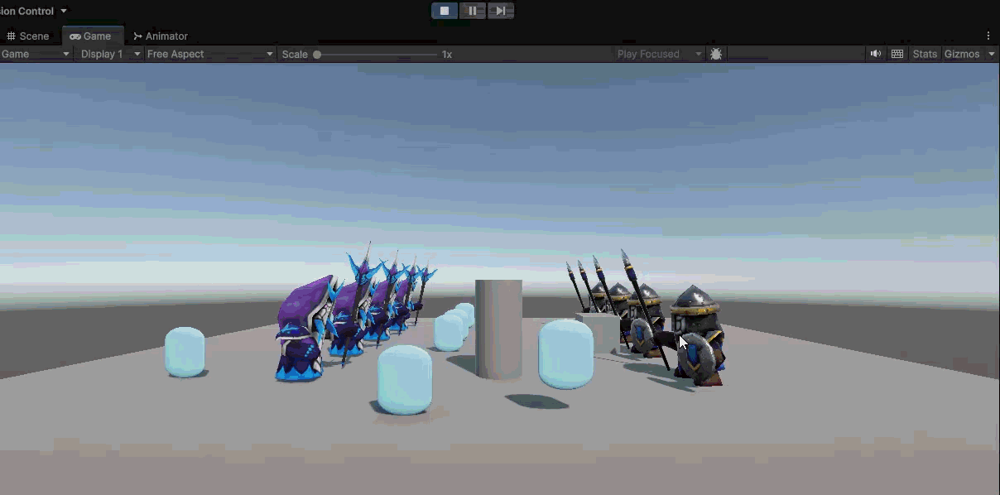
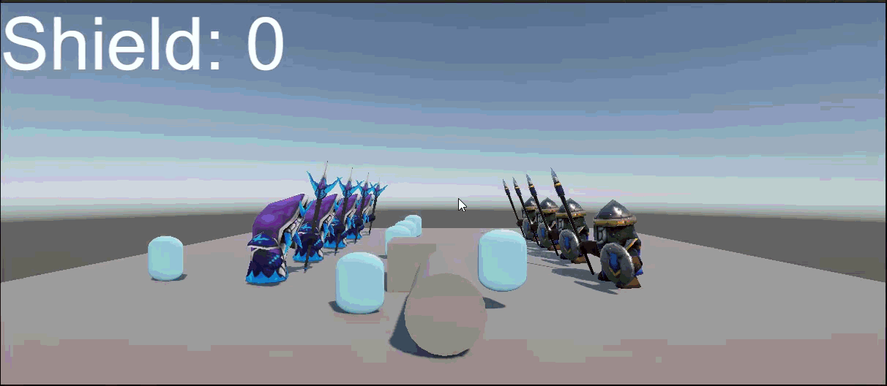
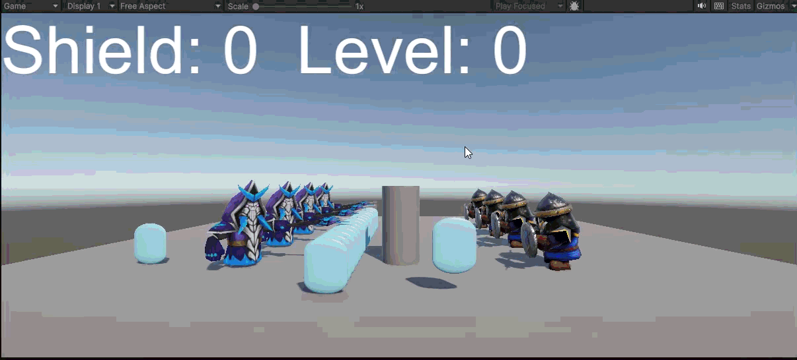

# Ejercicios Práctica 4:

1-
 
3- 
  
  1. 
  2. 

4- No conseguí que funcionara, miré todo, etiquetas, nombres, que los scripts estuvieran asociados en los listener/events, intenté usar patrón singleton, usar trensform o MovePosition, no me salían ni errores en la consola pero aún así no funcionaba.

5- 
6- 
7- 
8- Aún no tenemos el prototipo planteado.
9- Lo hice así desde un principio.